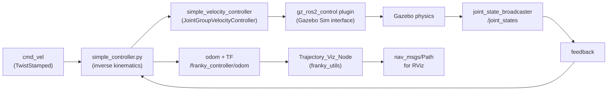

# Franky_AMR 🤖

A differential-drive Autonomous Mobile Robot (AMR) built as a **ROS 2 (Jazzy)** workspace, simulated in **Gazebo (gz-sim)** with `ros2_control` / `gz_ros2_control`, custom kinematics, and odometry-based trajectory visualization.

> This repo is both a working simulated robot stack **and** a personal ROS 2 learning sandbox.
---

## 📦 Overview

Franky is a two-wheel differential-drive robot with front and rear caster wheels. The stack currently supports:

- **URDF/Xacro robot description** with visual meshes, collision geometry, and inertial properties
- **Gazebo Sim integration** via `gz_ros2_control`, spawning the robot from `robot_description` and bridging simulation clock/topics
- **A hand-written differential-drive controller node** that:

- Converts `cmd_vel` → individual wheel velocity commands (inverse kinematics)
- Converts wheel joint states → robot odometry + TF (forward kinematics)
- **Trajectory visualization** — odometry is converted into a `nav_msgs/Path` for RViz
- **RViz configuration** for standalone robot visualization (no simulation required)

---

## 🗂 Repository Structure

```
Franky_AMR/
└── src/
    ├── franky_description/       # Robot model: URDF/Xacro, meshes, RViz + Gazebo launch files
    │   ├── URDF/
    │   │   ├── franky.urdf.xacro          # Main robot description (links, joints, inertials)
    │   │   ├── franky_gazebo.xacro        # Gazebo friction/contact params + gz_ros2_control plugin
    │   │   └── franky_ros2_control.xacro  # ros2_control hardware interface (velocity command, pos/vel state)
    │   ├── meshes/                        # STL visual/collision meshes (base, wheels, casters)
    │   ├── rviz/display.rviz              # Saved RViz layout
    │   └── launch/
    │       ├── display.launch.py          # RViz-only visualization (robot_state_publisher + joint_state_publisher_gui)
    │       └── gazebo.launch.py           # Spawns Franky in Gazebo Sim
    │
    ├── franky_controller/         # Custom differential-drive controller
    │   ├── franky_controller/simple_controller.py   # Inverse + forward kinematics, odom + TF publishing
    │   ├── config/franky_controllers.yaml           # controller_manager + JointGroupVelocityController config
    │   └── launch/controller.launch.py              # Spawns joint_state_broadcaster, velocity controller, and the node
    │
    ├── franky_utils/              # Supporting tools
    │   └── franky_utils/Trajectory_Viz_Node.py       # Subscribes to /odom, publishes nav_msgs/Path for RViz
    │
    ├── franky_py_examples/        # ROS 2 fundamentals sandbox (pub/sub, static TF, turtlesim)
    ├── frankybot_cpp_examples/    # Empty C++ package scaffold — reserved for future rclcpp work
    └── Theory/                    # Personal study notes on ROS 2 executors, nodes vs. processes, etc.
```

---

## 🧠 How It Works



1. **Description** — `franky.urdf.xacro` defines the robot's links/joints and pulls in Gazebo contact parameters and the `ros2_control` hardware interface (velocity-controlled wheel joints).
2. **Simulation** — `gazebo.launch.py` starts Gazebo Sim, spawns Franky from the `robot_description` topic, and bridges `/clock`.
3. **Control stack** — `controller.launch.py` spawns the `joint_state_broadcaster` and `simple_velocity_controller` (a `velocity_controllers/JointGroupVelocityController`), then starts the custom `simple_controller.py` node.
4. **Kinematics node (`simple_controller.py`)**:

- **Inverse kinematics**: listens on `franky_controller/cmd_vel`, converts linear/angular velocity into per-wheel velocity commands using the wheel radius/separation matrix, and publishes to `simple_velocity_controller/commands`.
- **Forward kinematics**: listens on `/joint_states`, integrates wheel velocities into robot pose (x, y, θ), and publishes `nav_msgs/Odometry` on `franky_controller/odom` plus a live `odom → base_footprint` TF transform.
5. **Trajectory visualization** — `Trajectory_Viz_Node` subscribes to the odometry topic and accumulates it into a `nav_msgs/Path`, published on `/franky_controller/trajectory` for RViz.

---

## 🔩 Robot Parameters

Parameter
Value
Notes

Wheel radius
`0.033 m`
Configurable via ROS param / launch arg

Wheel separation
`0.17 m`
Configurable via ROS param / launch arg

Drive type
Differential (2 driven wheels + 2 passive casters)
Front & rear caster, both fixed joints

Update rate
`50 Hz`
`controller_manager` update rate

Simulation time
Enabled (`use_sim_time: true`)
Set in `franky_controllers.yaml`

---

## 📡 Key Topics

Topic
Type
Direction (controller node)
Purpose

`franky_controller/cmd_vel`
`geometry_msgs/TwistStamped`
Subscribed
Velocity command input

`/joint_states`
`sensor_msgs/JointState`
Subscribed
Wheel joint positions from `joint_state_broadcaster`

`simple_velocity_controller/commands`
`std_msgs/Float64MultiArray`
Published
Per-wheel velocity commands

`franky_controller/odom`
`nav_msgs/Odometry`
Published
Estimated robot pose/velocity

`franky_controller/trajectory`
`nav_msgs/Path`
Published (by `franky_utils`)
Accumulated path for RViz

TF: `odom → base_footprint`
—
Broadcast
Live robot transform

---

## 🚀 Getting Started

### Prerequisites

- **ROS 2 Jazzy**
- **Gazebo Sim (Harmonic)** with `ros_gz_sim`, `ros_gz_bridge`, and `gz_ros2_control`
- Standard ROS 2 packages: `robot_state_publisher`, `joint_state_publisher_gui`, `rviz2`, `xacro`, `controller_manager`, `tf_transformations`

### Build

```
# From your ROS 2 workspace root, with this repo's src/ folder in place
colcon build
source install/setup.bash
```

### Run — Simulation

```
# Terminal 1: spawn Franky in Gazebo Sim
ros2 launch franky_description gazebo.launch.py

# Terminal 2: bring up controllers + kinematics node
ros2 launch franky_controller controller.launch.py

# Terminal 3 (optional): drive the robot
ros2 topic pub /franky_controller/cmd_vel geometry_msgs/msg/TwistStamped \
  "{twist: {linear: {x: 0.2}, angular: {z: 0.0}}}"
```

### Run — Visualization Only (no simulation)

```
ros2 launch franky_description display.launch.py
```

### Visualize the Trajectory

```
ros2 run franky_utils Trajectory_Viz_Node.py
# then add the /franky_controller/trajectory topic (nav_msgs/Path) in RViz
```

---

## 🧪 Learning Sandbox

Two packages are intentionally kept separate from the main robot stack, as they document the ROS 2 fundamentals this project was built on rather than being part of Franky's runtime pipeline:

- **`franky_py_examples`** — minimal publisher/subscriber pair, a static TF broadcaster example, and a turtlesim node computing the relative translation between two turtles.
- **`Theory/`** — written notes on ROS 2 executors (single- vs. multi-threaded), composable vs. non-composable nodes, and the process-vs-node distinction, plus a reference `rosgraph.png`.

`frankybot_cpp_examples` is a scaffolded-but-empty `ament_cmake` package, reserved for future `rclcpp`-based work.

---

## 🗺️ Roadmap

- [ ] Fill in package descriptions, maintainers, and licenses (currently `TODO` in `package.xml`)
- [ ] Add a top-level `LICENSE` file
- [ ] Integrate Nav2 for autonomous navigation (costmaps, planners, AMCL/SLAM)
- [ ] Add sensors (LiDAR/IMU/camera) to the URDF and Gazebo config
- [ ] Populate `frankybot_cpp_examples` with `rclcpp` implementations
- [ ] Add unit/integration tests beyond the default `ament_lint` checks

---

## ✍️ Author

**Prabudh Gautam**
📧 prabudhrocky2003@gmail.com
